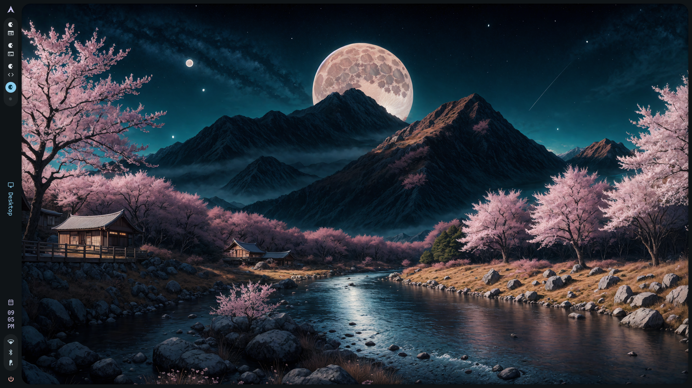
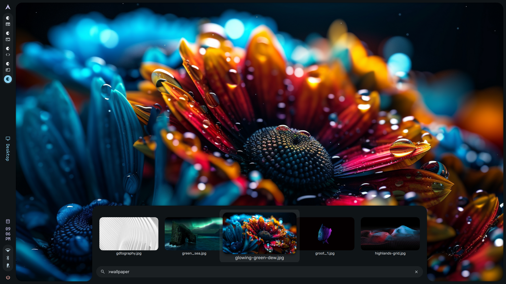
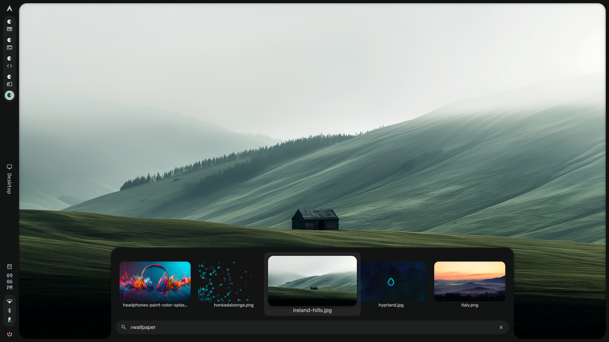
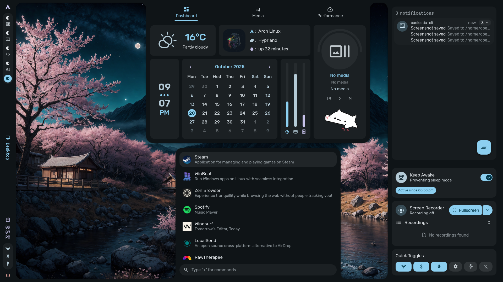

# 🌌 Caelestia

[](https://www.gnu.org/licenses/gpl-3.0)
[](https://github.com/caelestia-dots/caelestia/graphs/commit-activity)
[](http://makeapullrequest.com)
[](https://aur.archlinux.org/packages/caelestia-meta)

> A modern, elegant, and highly customizable dotfiles configuration for Linux, featuring Hyprland, Fish shell, and a carefully curated set of applications.

## 📸 Screenshots

|  | 
|:--:| 
| *Caelestia Desktop Environment* |

|  |
|
| *Application View* | *Terminal Workflow* |

|  |  |
|:--:|:--:|
| *Customization* | *All Tabs* |

## ✨ Features

- 🖥️ **Hyprland** - A dynamic tiling Wayland compositor
- 🐚 **Fish Shell** with Starship prompt for a modern terminal experience
- 🎨 Consistent theming across all applications
- ⚡ Optimized for performance and productivity
- 🔧 Easy installation and configuration
- 🎯 Works out of the box with sensible defaults

## 📦 Installation

### Prerequisites

- [Fish shell](https://github.com/fish-shell/fish-shell)
- Git
- An AUR helper (yay or paru) for Arch Linux users

### Quick Install (Recommended)

```bash
git clone https://github.com/caelestia-dots/caelestia.git ~/.local/share/caelestia
~/.local/share/caelestia/install.fish
```

> **Warning**
> The install script creates symlinks to the config files. Do not move or remove the repository after installation.

### Installation Options

The install script includes several options:

```bash
$ ./install.fish -h
Usage: ./install.fish [OPTIONS]

Options:
  -h, --help                  Show this help message
  --noconfirm                 Skip confirmation prompts
  --spotify                   Install Spotify with Spicetify
  --vscode=[codium|code]      Install VSCodium or VSCode
  --discord                   Install Discord with OpenAsar + Equicord
  --zen                       Install Zen browser
  --aur-helper=[yay|paru]     Specify AUR helper (default: auto-detect)
```

### Manual Installation

For manual installation, you'll need to install the following dependencies:

#### Core Dependencies

```bash
# Core Components
hyprland xdg-desktop-portal-hyprland xdg-desktop-portal-gtk
hyprpicker wl-clipboard cliphist inotify-tools app2unit
wireplumber trash-cli

# Terminal & Shell
foot fish fastfetch starship btop jq eza

# Theming
adw-gtk-theme papirus-icon-theme qt5ct-kde qt6ct-kde ttf-jetbrains-mono-nerd
```

#### Configuration Setup

1. Clone the repository:
   ```bash
   git clone https://github.com/caelestia-dots/caelestia.git ~/.local/share/caelestia
   ```

2. Create symlinks for configuration files:
   ```bash
   ln -sf ~/.local/share/caelestia/{hypr,foot,fish,fastfetch,uwsm,btop} ~/.config/
   ln -sf ~/.local/share/caelestia/starship.toml ~/.config/
   ```

## 🛠️ Application-Specific Setup

### 🎵 Spicetify (Spotify)

```bash
spicetify config current_theme caelestia color_scheme caelestia custom_apps marketplace
spicetify apply
```

### 💻 VSCode/VSCodium

1. Symlink configuration files:
   ```bash
   mkdir -p ~/.config/Code/User  # or ~/.config/VSCodium/User for VSCodium
   ln -sf ~/.local/share/caelestia/vscode/{settings.json,keybindings.json} ~/.config/Code/User/
   ln -sf ~/.local/share/caelestia/vscode/flags.conf ~/.config/code-flags.conf
   ```

2. Install the Caelestia extension:
   ```bash
   code --install-extension vscode/caelestia-vscode-integration/caelestia-vscode-integration-*.vsix
   ```

### 🌐 Zen Browser

1. Install Zen Browser
2. Set up the theme:
   ```bash
   mkdir -p ~/.zen/<profile>/chrome
   ln -sf ~/.local/share/caelestia/zen/userChrome.css ~/.zen/<profile>/chrome/
   ```

3. Install the native app:
   ```bash
   mkdir -p ~/.mozilla/native-messaging-hosts
   cp ~/.local/share/caelestia/zen/native_app/manifest.json ~/.mozilla/native-messaging-hosts/caelestiafox.json
   # Edit the manifest to replace {{ $lib }} with the absolute path to ~/.local/lib/caelestia
   mkdir -p ~/.local/lib/caelestia
   ln -sf ~/.local/share/caelestia/zen/native_app/app.fish ~/.local/lib/caelestia/caelestiafox
   ```

4. Install the [CaelestiaFox](https://addons.mozilla.org/en-US/firefox/addon/caelestiafox) extension

## 🔄 Updating

To update Caelestia and all dependencies:

```bash
# Update AUR packages (Arch Linux)
yay -Syu

# Update Caelestia configuration
cd ~/.local/share/caelestia
git pull
```

## ⌨️ Keybindings

| Key Combination | Action |
|----------------|--------|
| `Super` | Open application launcher |
| `Super` + `#` | Switch to workspace # |
| `Super` + `Shift` + `#` | Move window to workspace # |
| `Super` + `T` | Open terminal (foot) |
| `Super` + `W` | Open browser (Zen) |
| `Super` + `C` | Open IDE (VSCodium) |
| `Super` + `S` | Toggle special workspace |
| `Ctrl` + `Alt` + `Delete` | Open session menu |
| `Ctrl` + `Super` + `Space` | Toggle media play state |
| `Ctrl` + `Super` + `Alt` + `R` | Restart the shell |

## 🤝 Contributing

Contributions are welcome! Please feel free to submit a Pull Request.

1. Fork the repository
2. Create your feature branch (`git checkout -b feature/AmazingFeature`)
3. Commit your changes (`git commit -m 'Add some AmazingFeature'`)
4. Push to the branch (`git push origin feature/AmazingFeature`)
5. Open a Pull Request

## 📄 License

This project is licensed under the GPL-3.0 License - see the [LICENSE](LICENSE) file for details.

## 🙏 Acknowledgments

- [Hyprland](https://hyprland.org/) - The amazing Wayland compositor
- [Fish shell](https://fishshell.com/) - A smart and user-friendly shell
- [Starship](https://starship.rs/) - A minimal, blazing-fast prompt
- And all the amazing open-source projects that make this possible!
